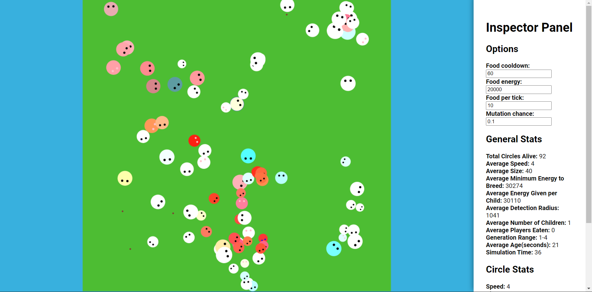
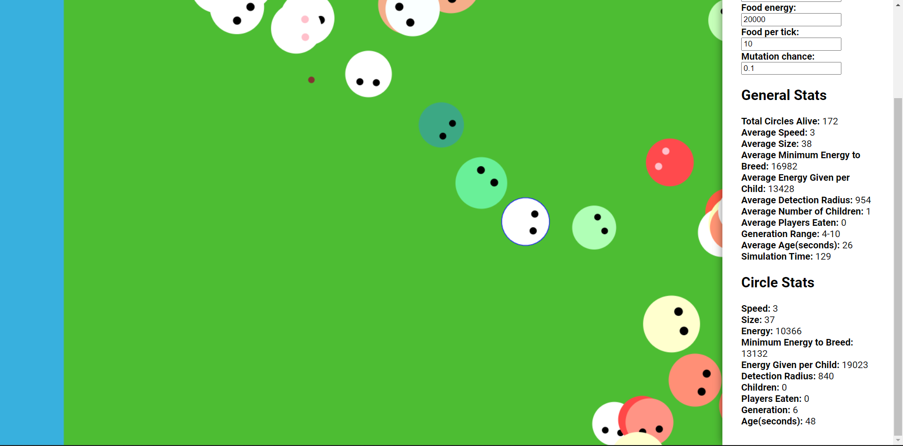

**Links:** [Demo](https://code-jam-7.jacklee7.repl.co/) [Source Code](https://replit.com/@JackLee7/Code-Jam-7#index.js)

This project was an attempt to simulate natural selection and evolution on a small number of genes in a virtual environment. Namely, the genes I included were: speed, energy needed to breed, energy given to children, detection radius, and size. Higher speed and size correspond to higher energy usage, but low speed and size make organisms more susceptiple to being eaten (those that are at least a certain amount smaller than another can be consumed by the other). I created it for one of Repl.it's Code Jams for which it won first place. I built this project using **no external libraries**, and took advantage of the **HTML5 Canvas API** as well as **ES6 Classes**. 

Along with showing a visualization of the simulation, this project also featured an inspector panel that allows you to both check the stats of the simulation as a whole and the stats of individual organisms. It also gave users the option to change some options controlling how the simulation was run. 

Finally, I also implemented a working moveable camera for this project that allows users to change their perspective when viewing the simulation. 

This project could definitely use more tweaking or increased depth of simulation. After many runs of the simulation, I noticed that the circles always tended towards large and slow organisms. One interesting pattern, though, was that circles would generally become homogeneously large and slow, after which they would uniformally gradually become smaller. Eventually, however, a random mutation of a fast and large circle appears that upsets the balance until the circles become large and slow again.