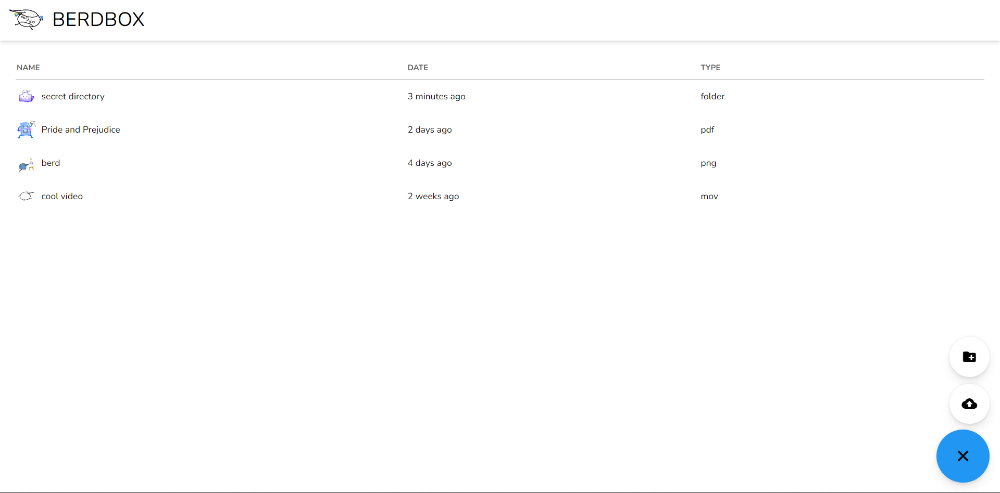
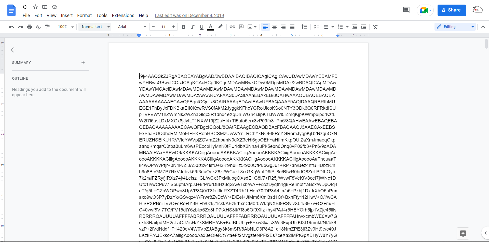
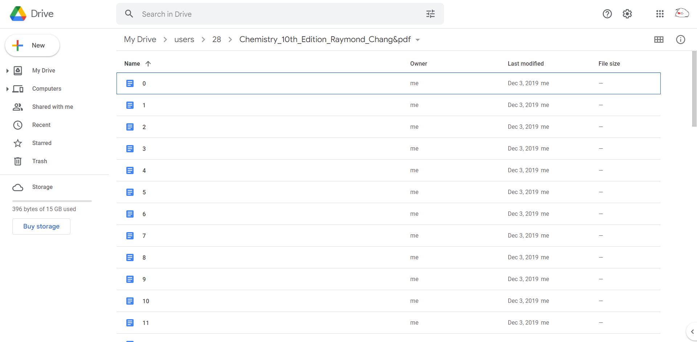

[Github](https://github.com/jacklee5/infinite-storage-app)

This project exploits the fact that Google Documents do not count towards Google's storage quota. Therefore, if you are able to store normal files as Google Documents, you can have infinite storage. This is what this project does. I worked on this project with a small group in which I was mainly responsible for the backend, including interfacing with the Google Drive API and providing an API so the frontend could dynamically display files. the main technologies used on this project were **React**, **Passport.js**, **Express**, **Node.js**, and **MySQL**. Here is an image of the finished project:

The first problem I encouuntered when building this project was that you cannot directly store binary data into Google Documents. To circumvent this problem, I serialized the file data into base64, which uses a set of symbols supported by Google Docs. Here is an example of a jpg file being stored in a Google Doc:

However, because base64 expands binary data into a set of 64 symbols, it greatly increases the amount of storage required by files. One way to potentially circumvent this is by using a different encoding system, or creating a custom encoding system that utilizes all characters allowed by Google Docs. But because base64 was easy to convert to and from, I opted to keep using it. However, Google Docs (as it turns out) does have a file size limit. My solution to this was to separate file data across multiple files, collected into a folder:

Multiple files being collected into a folder - notice only 396 bytes are being used in total. This chemistry textbook alone used several megabytes.

Finally, because large files often required hundreds of Google Docs to store, I implemented a timed queue to avoid getting rate-limited. 

Some ways this project can be improved is by also using a Google Doc (or even a Google Sheet) to store user data. That way, the only resource required to run this service would be a Node server. Overall, I think I learned quite a bit about using external APIs as well as building my own APIs from this project.