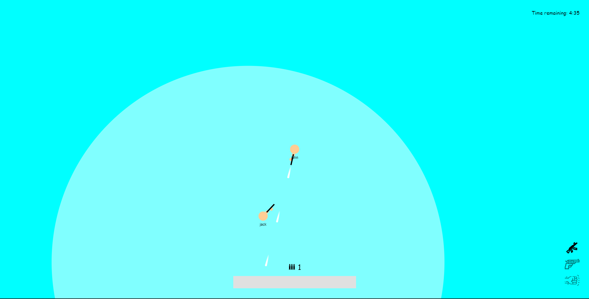
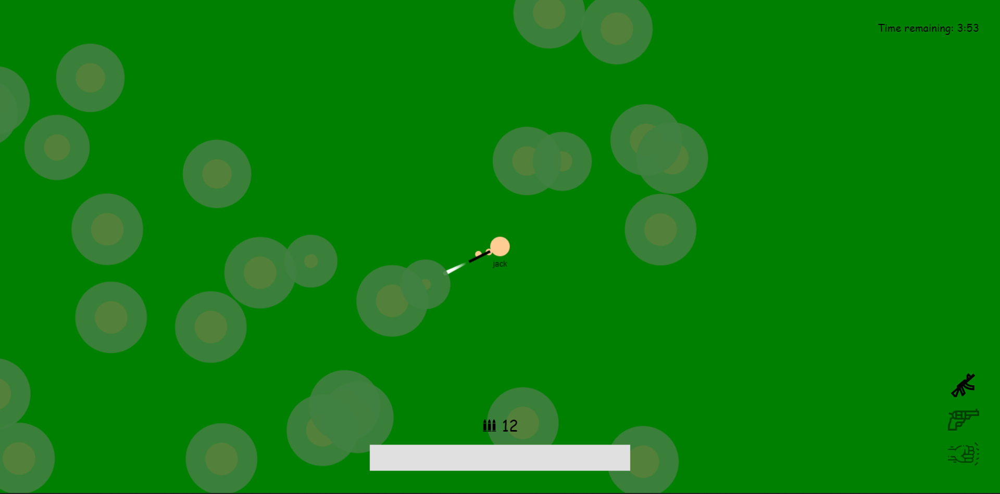
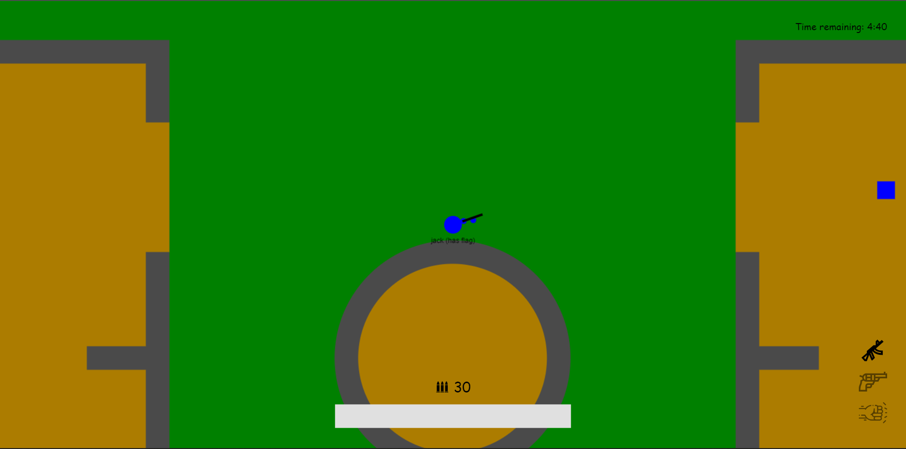
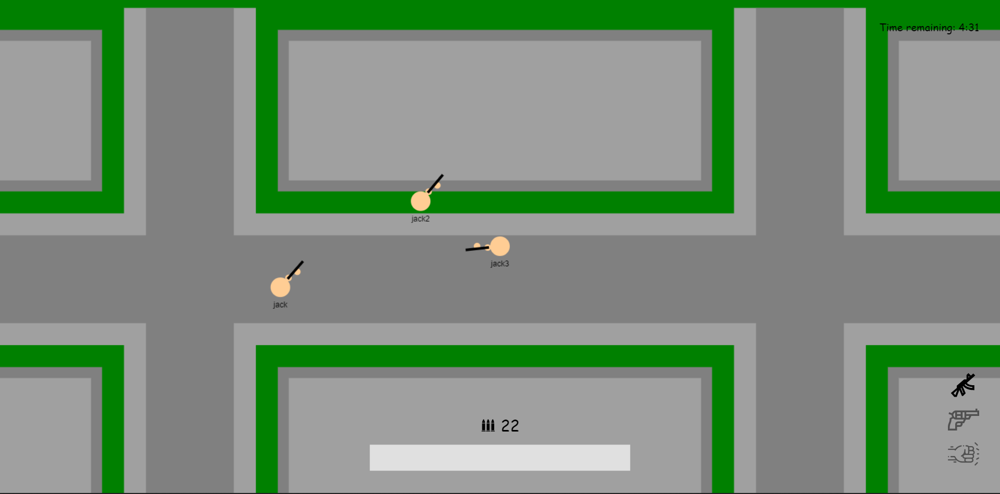
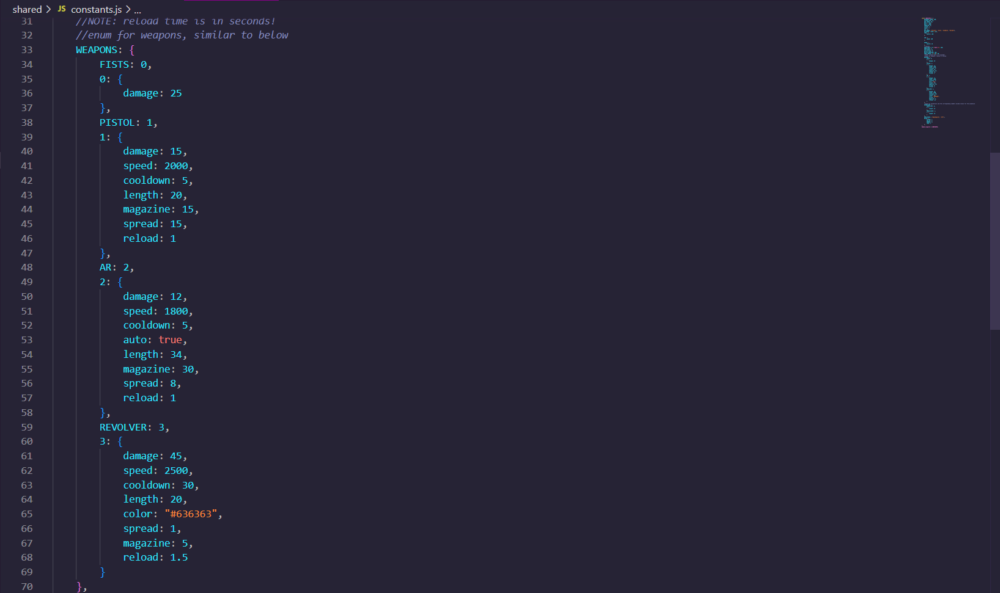

**Links:** [Demo](https://topdown-shooter.jacklee7.repl.co/) [GitHub](https://github.com/jacklee5/topdown-shooter)

This project is a basic multiplayer 2D shooter from a topdown perspective that I worked on with a small group of other students. This project uses the **HTML5 Canvas** API on the front end, **Node.js** running **p2** for physics on the backend, and **socket.io** to connect the two. There are two modes: deathmatch and capture the flag; as well as four maps: a randomly generated forest with destructible trees, a city map, a circular “iceberg” map where you can shove other players into the water, and a map made specifically for capture the flag. Here are some pictures of the maps:

Iceberg

Forest

Capture the Flag

City

Another cool feature that we implemented was a config file that allowed the parameters of weapons as well as other elements of the game to be easily tweaked.

